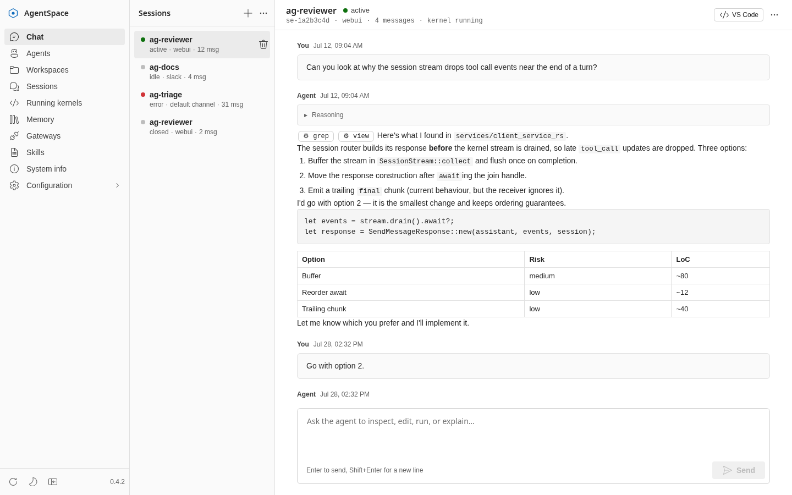
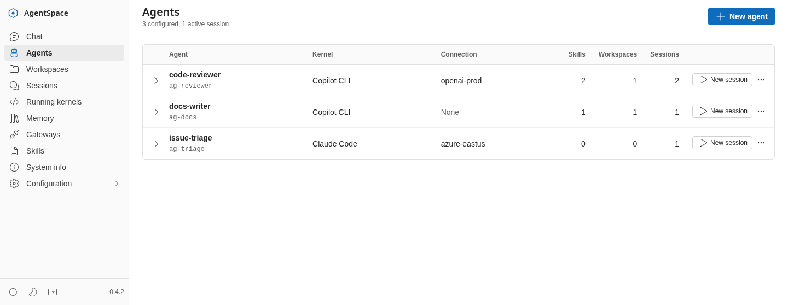
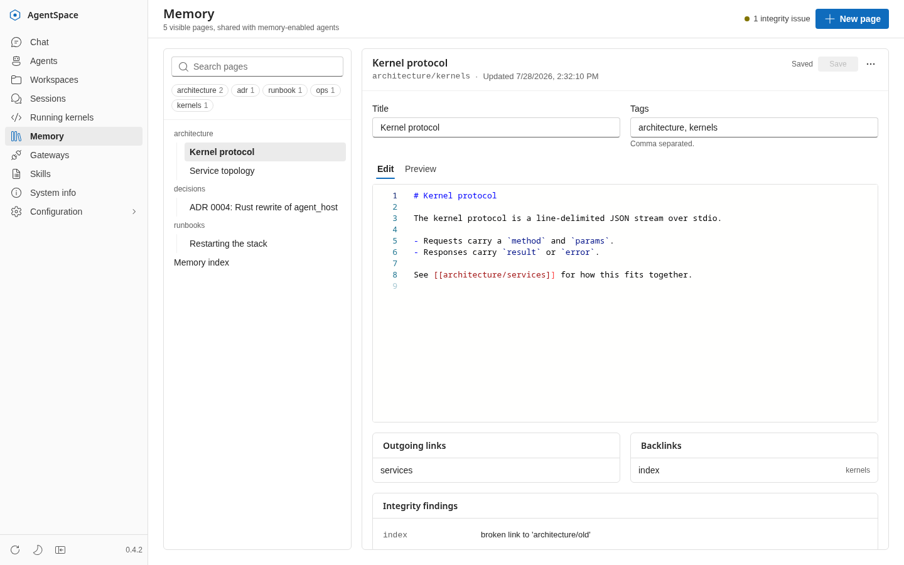
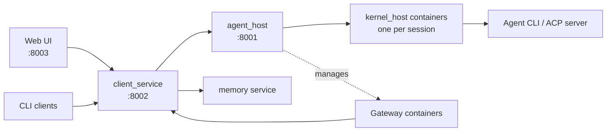

# AgentSpace

[](https://github.com/andysalerno/agentspace/actions/workflows/ci.yml)

AgentSpace is a local control plane for defining, running, and observing AI
agents. It wraps external agent CLIs behind a shared kernel protocol, runs
sessions in isolated containers, and exposes them through a web application,
an HTTP API, terminal clients, and gateway integrations.

<picture>
  <source media="(prefers-color-scheme: dark)" srcset="docs/images/webui-chat-dark.png">
  
</picture>

<details>
<summary>More screenshots</summary>

Agents, each bound to a harness, model connection, skills, and workspaces:

<picture>
  <source media="(prefers-color-scheme: dark)" srcset="docs/images/webui-agents-dark.png">
  
</picture>

The shared Markdown memory corpus, with links, backlinks, and integrity checks:

<picture>
  <source media="(prefers-color-scheme: dark)" srcset="docs/images/webui-memory-dark.png">
  
</picture>

</details>

> [!IMPORTANT]
> AgentSpace is a personal, experimental project built for my own use. It is
> under active development, has no stability or compatibility guarantees, and
> is not currently intended to be installed, operated, or depended on by other
> people. This repository is public for visibility and reference, not because
> AgentSpace is ready for general use.

> [!CAUTION]
> The stack is designed for a trusted, single-user environment. It has no
> general-purpose user authentication, and `agent_host` controls the local
> container engine through its socket. Do not expose its services directly to
> an untrusted network.

## What it does

AgentSpace provides a common layer around otherwise independent agent
harnesses:

- define agents with a harness, system prompt, skills, and environment;
- run each agent session in its own `kernel_host` container;
- chat through a React web UI or a small CLI client;
- inspect sessions, messages, tool calls, logs, and running kernels;
- attach persistent workspaces and open container-hosted VS Code sessions;
- manage reusable skills, model connections, and write-only secret values;
- connect agents to gateway processes such as Discord;
- give selected agents access to a shared, durable Markdown memory corpus; and
- export, validate, plan, and apply declarative YAML configuration.

Harness adapters currently represented in the system include ACP, GitHub
Copilot CLI, Claude Code, Codex, OpenCode, and an in-process echo harness.
Their maturity and required external authentication vary. The echo harness is
the easiest way to exercise the stack without credentials. The ACP harness can
run either opencode or pi; see [docs/ACP_AGENTS.md](docs/ACP_AGENTS.md).

## Architecture



`client_service` is the client-facing API and persistence layer. Clients
should not call `agent_host` directly. `agent_host` manages session,
workspace, gateway, and container lifecycles. Each kernel container translates
between a harness-specific protocol and AgentSpace's common event model.

## Quick start

### Requirements

- Linux with [Podman](https://podman.io/) or Docker and Compose
- [`just`](https://just.systems/)
- enough local resources to build the Rust, Python, and web container images

For rootless Podman, start its Docker-compatible API socket:

```sh
systemctl --user enable --now podman.socket
```

Create the local configuration:

```sh
cp .env.example .env
```

Edit `.env` and set `KERNEL_WORKDIR` to a dedicated absolute working directory
for agent sessions. Do not point it at directories containing credentials or
other data that agents should not access.

Start the stack:

```sh
just stack-up
```

Then open <http://127.0.0.1:8003>. Create an agent using the `echo` harness for
a credential-free smoke test.

Useful stack commands:

| Command | Purpose |
| --- | --- |
| `just stack-up` | Build and start the full stack |
| `just stack-status` | Show service status |
| `just stack-logs` | Follow stack logs |
| `just stack-down` | Stop the stack and clean up spawned containers |
| `just build-image-stack` | Build all stack images without starting them |

`just stack-up` selects a reachable Podman daemon when available and otherwise
uses Docker. Set `CONTAINER_RUNTIME=podman` or `CONTAINER_RUNTIME=docker` to
choose explicitly.

### Using Copilot CLI

The Docker helper can populate the named Copilot configuration volume used by
spawned kernel containers:

```sh
cp kernels/kernel_host/.env.example kernels/kernel_host/.env
# Set KERNEL_WORKDIR in that file.
./kernels/kernel_host/spawn-kernel.sh setup
```

Run `/login` in the interactive Copilot session. This helper currently uses
Docker Compose directly. Other harnesses have their own authentication and
configuration requirements.

## Services and data

| Component | Location | Default endpoint |
| --- | --- | --- |
| Web UI | `clients/webui` | <http://127.0.0.1:8003> |
| Client API | `services/client_service_rs` | <http://127.0.0.1:8002> |
| Agent host | `services/agent_host_rs` | <http://127.0.0.1:8001> |
| Memory service | `services/memory_rs` | Internal Compose network only |

Local state includes:

- client-service SQLite data under `mounts/data/client_service`;
- the shared memory corpus in the `agentspace-memory-data` named volume;
- managed skills in the `agentspace-skills` named volume, with built-in skills
  sourced from `mounts/skills`; and
- harness authentication state in harness-specific named volumes.

`CLIENT_SERVICE_SECRET_KEY` encrypts write-only configuration secrets stored in
SQLite. Generate it with `openssl rand -base64 32` before storing secrets, keep
it stable for the lifetime of the database, and never commit `.env` files.

## Development

AgentSpace is a monorepo with:

- Rust services in a Cargo workspace;
- Python packages in a `uv` workspace;
- a React/TypeScript application managed with pnpm; and
- container images and Compose files for integration testing and local use.

The current toolchain is Python 3.14, Rust stable, Node.js 26, and pnpm 11.
Version constraints and lockfiles in the repository are authoritative.

Install dependencies and run the full verification suite:

```sh
just bootstrap
just check
```

Common development commands:

| Command | Purpose |
| --- | --- |
| `just bootstrap` | Install Python and web dependencies |
| `just test` | Run Rust, Python, and web tests |
| `just check` | Run formatting, linting, type checks, tests, and the web build |
| `just client-service-check` | Check only `client_service` |
| `just agent-host-check` | Check only `agent_host` |
| `just webui-lint` | Run web lint and dead-code checks |

### Development container

The optional openSUSE development container includes the repository toolchain,
Podman tooling, GitHub CLI, and a persistent VS Code tunnel environment:

```sh
systemctl --user enable --now podman.socket
just dev-start
podman logs --follow agentspace-dev
just dev-shell
```

The container uses the host's rootless Podman socket, so it can build and run
the same stack. Its default home directory is a persistent named volume.

## Repository layout

| Path | Purpose |
| --- | --- |
| `kernels/` | Kernel protocol, harness adapters, and `kernel_host` |
| `gateways/` | Gateway protocol and integrations |
| `services/agent_host_rs/` | Session, workspace, gateway, and container lifecycle |
| `services/client_service_rs/` | Client API, persistence, and configuration control plane |
| `services/memory_rs/` | Durable Markdown memory CLI and private HTTP service |
| `clients/webui/` | React dashboard |
| `clients/cli_ui/` | Terminal UI experiments |
| `channels/cli_channel/` | Minimal command-line session client |
| `mounts/skills/` | Built-in skills mounted into the stack |
| `docs/` | Architecture notes, feature designs, and historical plans |
| `compose.yaml` | Full local stack |
| `justfile` | Primary development and operations commands |

Files under `docs/` include working notes and plans and may lag behind the
implementation. The code, Compose configuration, and `justfile` are the source
of truth for current behavior.

## Project status

This project changes quickly. APIs, database schemas, configuration formats,
container layouts, and user-facing workflows may change without migration
paths or release notes. There is currently:

- no supported release or installation process;
- no multi-user or internet-facing security model;
- no compatibility promise for APIs or persisted state;
- no expectation of support for third-party deployments; and
- no commitment that experimental harnesses or features will keep working.

In short: this is the source tree for my personal AgentSpace installation, not
a finished product.

## License

No license has been selected yet.
