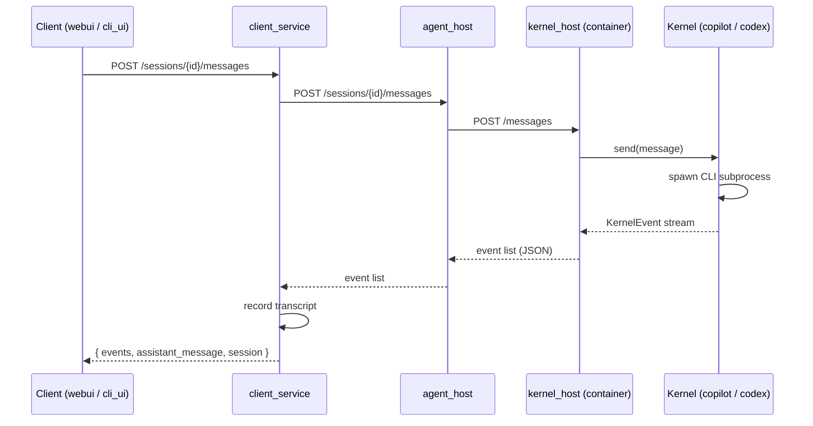

# AgentSpace — System Overview

AgentSpace is a system for defining, interacting with, and observing AI agents. It wraps headless agent CLIs (GitHub Copilot CLI, OpenAI Codex, etc.) in a uniform interface and exposes them through a layered service architecture with web and terminal UIs.

## Goals

1. **Uniform agent interface** — Abstract over different AI agent CLIs behind a single protocol so callers never deal with harness-specific I/O.
2. **Container isolation** — Each agent session runs in its own Docker container, with its own process and filesystem.
3. **Layered services** — Separate kernel lifecycle, session orchestration, and user-facing concerns into distinct services with clean boundaries.
4. **Multiple clients** — Support web, terminal, and programmatic access through a single gateway API.

## Architecture

```
┌─────────────────────────────────────────────────────────┐
│                        Clients                          │
│  ┌─────────┐   ┌─────────┐   ┌──────────────┐          │
│  │  webui  │   │ cli_ui  │   │ cli_channel   │          │
│  │ :8003   │   │ (TUI)   │   │ (headless)    │          │
│  └────┬────┘   └────┬────┘   └──────┬───────┘          │
│       │              │              │                   │
│       └──────────────┼──────────────┘                   │
│                      │ HTTP                             │
│              ┌───────▼────────┐                         │
│              │ client_service │  user-facing gateway     │
│              │     :8002      │  agents, sessions,       │
│              │                │  transcripts             │
│              └───────┬────────┘                         │
│                      │ HTTP                             │
│              ┌───────▼────────┐                         │
│              │   agent_host   │  kernel lifecycle,       │
│              │     :8001      │  skills, container mgmt  │
│              └───────┬────────┘                         │
│                      │ Docker API + HTTP                │
│       ┌──────────────┼──────────────┐                   │
│  ┌────▼────┐    ┌────▼────┐    ┌────▼────┐              │
│  │ kernel  │    │ kernel  │    │ kernel  │  ...          │
│  │ :8000   │    │ :8000   │    │ :8000   │              │
│  │(echo)   │    │(copilot)│    │(codex)  │              │
│  └─────────┘    └─────────┘    └─────────┘              │
│  one container per session                              │
└─────────────────────────────────────────────────────────┘
```

All inter-service communication uses HTTP (FastAPI). Kernel containers are spawned dynamically by `agent_host` and communicate over a shared Docker network (`agentspace-stack`).

## Repository Layout

```
agentspace/
├── kernels/
│   ├── kernel/              # Protocol, events, base class (the abstraction)
│   ├── kernel_echo/         # In-process echo kernel (testing)
│   ├── kernel_copilot/      # GitHub Copilot CLI adapter
│   ├── kernel_codex/        # OpenAI Codex CLI adapter
│   └── kernel_host/         # Container entry point + HTTP service
├── services/
│   ├── agent_host/          # Kernel lifecycle manager + skills
│   └── client_service/      # Public API gateway
├── clients/
│   ├── webui/               # React/TypeScript dashboard
│   └── cli_ui/              # Textual TUI client
├── channels/
│   └── cli_channel/         # Headless CLI session client
├── compose.yaml             # Full-stack Docker Compose
├── justfile                 # Dev workflow commands
└── pyproject.toml           # uv workspace root
```

## Components

### Kernel Layer

The kernel is the innermost layer. It wraps a headless agent CLI and exposes a uniform async interface.

#### `kernel` — Protocol & Events

Defines the structural type contract (`Kernel` protocol), the `BaseKernel` subprocess helper, and the standard JSONL event format. All kernels emit the same event types:

| Event | Purpose |
|-------|---------|
| `session_start` | Emitted once with `session_id` and kernel name |
| `status` | Transitions: `idle`, `busy`, `error`, `done` |
| `text_delta` | Incremental text chunk from the agent |
| `tool_call` | Agent is invoking a tool |
| `tool_result` | Result of a tool invocation |
| `error` | Non-fatal error or warning |
| `session_end` | Session complete, kernel will exit |

The `Kernel` protocol:

```python
class Kernel(Protocol):
    @property
    def name(self) -> str: ...
    @property
    def status(self) -> KernelStatus: ...
    @property
    def resume_token(self) -> str | None: ...
    async def start(self, config: KernelConfig) -> None: ...
    async def send(self, message: str) -> None: ...
    def recv(self) -> AsyncIterator[KernelEvent]: ...
    async def stop(self) -> None: ...
```

`BaseKernel` provides shared subprocess machinery (spawn, read stdout/stderr, queue events). Harness-specific subclasses override `harness_cmd()`, `harness_env()`, and `parse_harness_output()`.

#### `kernel_echo` — Reference Implementation

Echoes input back word-by-word as `text_delta` events. No subprocess. Used for testing the infrastructure end-to-end without API keys or a real harness.

#### `kernel_copilot` — GitHub Copilot CLI

Wraps the `copilot` CLI in non-interactive prompt mode with JSON output. Supports session resumption via `--resume=SESSION_ID`, model selection, reasoning effort, and additional skill directories via `--add-dir`. Maps Copilot-specific events (`assistant.message_delta`, `assistant.tool_call`, etc.) into the standard event stream.

#### `kernel_codex` — OpenAI Codex CLI

Wraps `codex exec` with similar patterns. Supports session threads, model selection, and maps Codex events (`turn.completed`, `agent_message`, `command_execution`) into the standard stream.

#### `kernel_host` — Container Entry Point

Runs inside each kernel container. Has two modes:

- **Runner mode** (`python -m kernel_host.runner "prompt"`) — one-shot CLI that prints JSONL to stdout.
- **Service mode** (`python -m kernel_host.app`) — long-lived FastAPI server (port 8000) exposing `/messages`, `/session`, `/history`, `/logs`, and `/reset` endpoints. This is the mode used in production; `agent_host` talks to each container over HTTP.

A registry maps harness names (`echo`, `copilot-cli`, `codex`) to kernel classes.

### Service Layer

#### `agent_host` — Kernel Lifecycle Manager

Manages kernel sessions by spawning and supervising Docker containers. Each session gets its own container (`agentspace-kernel-{session_id[:12]}`) running the `kernel_host` image.

Responsibilities:
- Create/destroy kernel containers via the Docker API
- Route messages to the correct container's HTTP API
- Track session state (active, status, metadata)
- Manage skills on a shared Docker volume (`agentspace-skills`)

Key API endpoints (port 8001):

| Route | Purpose |
|-------|---------|
| `POST /sessions` | Create a session (spawns a container) |
| `POST /sessions/{id}/messages` | Send a message, receive events |
| `GET /sessions` | List sessions |
| `DELETE /sessions/{id}` | Destroy session (removes container) |
| `POST /sessions/{id}/reset` | Reset session |
| `GET /sessions/{id}/history` | Message turn history |
| `GET /sessions/{id}/logs` | Raw subprocess output |
| `CRUD /skills` | Create, list, get, update, delete skills |

The `DockerKernelRuntime` implements the `KernelRuntime` protocol, which could be swapped for a different container backend.

#### `client_service` — Public API Gateway

The single entry point for all clients. No client talks to `agent_host` directly.

Responsibilities:
- CRUD for agent definitions (name, harness type, system prompt, skills)
- Session lifecycle — maps client-facing sessions to `agent_host` sessions
- Chat transcript persistence (in-memory for now)
- Session source tracking (`channel_name`, `client_type`)

Key API endpoints (port 8002):

| Route | Purpose |
|-------|---------|
| `CRUD /agents` | Agent definitions |
| `POST /sessions` | Create session for an agent |
| `GET /sessions` | List sessions |
| `GET /sessions/{id}/messages` | Chat transcript |
| `POST /sessions/{id}/messages` | Send message |
| `GET /kernels` | List kernel sessions (proxied) |
| `DELETE /kernels/{id}` | Kill a kernel (proxied) |
| `GET /kernels/{id}/logs` | Kernel logs (proxied) |
| `CRUD /skills` | Skills management (proxied) |

Data models: `AgentRecord`, `SessionRecord`, `MessageRecord`, with `HarnessName` enum (`echo`, `copilot-cli`, `codex`) and `ClientType` enum (`cli`, `webui`).

### Client Layer

#### `webui` — React Dashboard

A TypeScript/React single-page app served via Nginx (port 8003). Views:

- **Chat** — select an agent, start a session, send messages, view streaming responses
- **Agents** — create/edit/delete agent definitions
- **Sessions** — list and manage chat sessions
- **Kernels** — view running kernel containers, logs, kill kernels
- **Skills** — CRUD for skills with a Monaco code editor

Features: dark mode, collapsible sidebar, responsive layout. Talks only to `client_service`.

#### `cli_ui` — Terminal UI

A Python TUI built with [Textual](https://textual.textualize.io). Provides the same capabilities as the web UI in a terminal: agent selection, session management, chat with streaming output. Talks only to `client_service`.

#### `cli_channel` — Headless CLI Client

A thin `httpx`-based client that creates or resumes sessions through `client_service`. Proof-of-concept for external integrations and channel relay processes.

## Data Flow

A chat message flows through the full stack:



## Docker Compose Stack

The `compose.yaml` defines four services:

| Service | Port | Role |
|---------|------|------|
| `kernel-host-image` | — | Build-only; produces the kernel container image |
| `agent-host` | 8001 | Spawns kernel containers, mounts Docker socket |
| `client-service` | 8002 | Public gateway |
| `webui` | 8003 | Static React app + Nginx reverse proxy |

Kernel containers are not defined in Compose — they are created dynamically by `agent_host` using the Docker API. They join the `agentspace-stack` network and share two named volumes:

- `agentspace-kernel_copilot-config` — Copilot authentication data
- `agentspace-skills` — skill files mounted read-only into kernels

## Development

### Prerequisites

- Python 3.13+, [uv](https://docs.astral.sh/uv/) package manager
- Node.js (for webui)
- Docker

### Workspace

The repo is a `uv` workspace. All Python packages are workspace members:

```
kernels/*  services/*  channels/*  clients/cli_ui
```

### Commands

```bash
just bootstrap       # uv sync + npm install
just stack-up        # docker compose up -d --build
just stack-down      # docker compose down + cleanup
just stack-logs      # tail logs
just stack-status    # docker compose ps
```

### Quality

```bash
uv run pytest        # tests
uv run ruff check .  # lint
uv run pyright       # strict type checking
```

The codebase uses strict pyright type-checking, ruff with all lint rules enabled, and pytest with async support.

## Current Status

**Implemented:**

- Kernel abstraction with protocol, base class, and JSONL event contract
- Three kernel implementations: echo, copilot-cli, codex
- Kernel host with both runner and HTTP service modes
- Docker-based kernel container lifecycle
- Agent host service with skills management
- Client service gateway with agents, sessions, and transcript storage
- Web UI with chat, agents, sessions, kernels, and skills views
- Terminal UI with equivalent functionality
- CLI channel proof-of-concept
- Full Docker Compose stack
- Automated tests for events, kernels, runner, services

**Not yet implemented:**

- `proto/` — formal API contract definitions
- `channels/` — platform relays (Discord, Matrix, IRC)
- `store/` — durable database persistence (currently in-memory)
- Streaming attach / real-time observer fan-out
- Authentication and multi-user support
