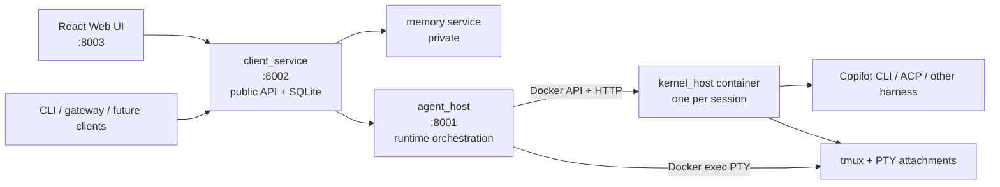

# AgentSpace system overview

AgentSpace defines, runs, and observes AI agents through one durable control
plane. Harness-specific CLIs run in isolated kernel containers; clients use
`client_service`, not the container runtime or `agent_host` directly.

## Architecture



Compose uses the `agentspace-stack` network. Dynamic kernel and gateway
containers are created by `agent_host`, not declared as long-running Compose
services.

### `client_service`

The public gateway and durable authority:

- agent, connection, secret, workspace, gateway, and skill configuration;
- durable Chat and CLI session records in SQLite;
- non-secret CLI launch snapshots and durable Copilot UUIDs;
- Chat transcript persistence;
- terminal HTTP controls and bounded WebSocket proxying; and
- orphan cleanup decisions based on durable session ownership.

### `agent_host`

The runtime orchestrator:

- creates, adopts, replaces, and destroys labeled kernel containers;
- reuses stable session-workspace volumes;
- validates full session, role, mode, and harness labels;
- proxies structured kernel HTTP operations;
- owns Docker exec PTY attach/resize and bounded attachment queues; and
- reconciles stale tmux clients after service restart.

Ordinary shutdown is non-destructive. Explicit session deletion and managed
orphan cleanup are destructive.

### `kernel_host`

The per-session container service:

- exposes the common Chat/event interface for headless harness adapters;
- shares Copilot launch/provider/profile/skill construction with Chat;
- manages one named tmux session for interactive Copilot CLI mode; and
- reports pane state, exit status, clients, and fixed attach argv.

PTY bytes do not pass through kernel HTTP. `agent_host` attaches the fixed tmux
argv with Docker exec and forwards raw bytes over WebSocket.

## Session modes

### Chat

A client sends a message to `client_service`, which ensures the stable runtime,
streams normalized kernel events through `agent_host`, and persists the
resulting transcript.

### CLI

1. `client_service` creates a durable session row before runtime work.
2. It stores a generated Copilot UUID and a non-secret launch snapshot.
3. Current secret/config values are resolved only when a runtime is ensured.
4. `agent_host` creates or adopts the labeled container and stable workspace.
5. `kernel_host` atomically creates/adopts the named tmux session.
6. Each WebSocket creates an independent Docker exec tmux client.
7. Binary frames remain raw PTY input/output; text frames carry resize and
   lifecycle control.

Multiple browsers or future terminal clients can attach simultaneously. Tmux
owns the process and scrollback, so detaching clients does not stop Copilot.
See [TERMINAL_PROTOCOL.md](TERMINAL_PROTOCOL.md).

## Identity, persistence, and recovery

The full client session ID is the stable runtime identity. Containers and
session-workspace volumes carry:

```text
agentspace.managed=true
agentspace.role=kernel|session-workspace
agentspace.session_id=<full durable session id>
agentspace.interaction_mode=chat|cli
```

Kernel containers also carry the harness label. Truncated resource names are
cosmetic and are never sufficient for adoption or deletion.

Persistence boundaries:

- browser/Web UI disconnect: the live tmux session continues;
- `client_service` or `agent_host` restart: a surviving labeled container and
  tmux session are adopted;
- kernel container or host loss: the exact pane, process, screen, and tmux
  scrollback are lost;
- recovery after container/host loss: the same Copilot UUID, Copilot state
  volume, and session-workspace volume launch a new tmux process and report
  `attach_kind=resumed`; and
- missing required config, secret, Copilot state, or session workspace:
  recovery fails explicitly and never substitutes a new Copilot UUID.

Pre-migration records without durable workspace identity are exposed as
`legacy-unrecoverable`.

## Data and volumes

| Data | Location |
| --- | --- |
| Configuration, sessions, transcripts, encrypted secrets | `mounts/data/client_service/client_service.sqlite` |
| Secret encryption key | `CLIENT_SERVICE_SECRET_KEY` outside the database |
| Copilot authentication and durable session state | `agentspace-kernel_copilot-config` |
| Per-session working files | labeled `agentspace-session-workspace-*` volumes |
| Managed skills | `agentspace-skills` |
| Shared Markdown memory | `agentspace-memory-data` |
| User workspaces and skill resources | separately labeled named volumes |

## Trust boundary

AgentSpace has no user authentication. The terminal is a shell-equivalent
capability, and `agent_host` controls the local container engine socket.
Compose binds published ports to loopback by default. Trusted local use needs
no TLS certificates. Do not expose the services to an untrusted network; add
authentication, authorization, and TLS at a trusted reverse proxy first.

## Operations and validation

```sh
just stack-up
just stack-status
just stack-logs
just stack-down
just terminal-container-integration
just webui-screenshots
just check
```

`stack-down` cleans only explicitly managed, labeled dynamic resources and
retains durable owned workspace volumes. See [OPERATIONS.md](OPERATIONS.md) for
backup, restart/adoption, cleanup, and container-gated validation guidance.
