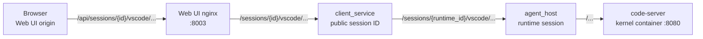

# VS Code Web UI proxy

AgentSpace opens a session's code-server instance through the Web UI origin:

```text
/api/sessions/{session_id}/vscode/
```

The browser must not navigate to the session's advertised `vscode_url`
directly. That URL uses a dynamically published host port and may work on the
AgentSpace host while being blocked by a firewall or unreachable from another
machine.

This document covers the session VS Code buttons in the Chat and CLI views. The
workspace-editor flow under `/workspaces/{workspace_id}/vscode` is separate and
does not currently use this proxy.

## Request path



1. `sessionVscodeUrl` in `clients/webui/src/browserUrls.ts` constructs the
   same-origin browser URL. Chat and CLI still use the session's non-null
   `vscode_url` as the capability signal that decides whether to show the
   button, but they do not navigate to that value.
2. `clients/webui/nginx.conf.template` matches the VS Code path before the
   general `/api/` location, removes the `/api` prefix, and preserves HTTP
   streaming and WebSocket upgrade headers.
3. `client_service` validates the durable public session, resolves its current
   `agent_host_session_id`, removes its own VS Code route prefix, and forwards
   the remaining path and query.
4. `agent_host` resolves an agent-host-reachable code-server base URL from the
   runtime, removes its route prefix, and forwards the remaining path and query
   to code-server.

Every suffix matters. code-server loads nested assets and WebSockets relative
to the browser URL, so all three proxy layers must preserve arbitrary paths and
queries below the session's `/vscode` prefix.

## Two URL configurations

These settings solve different network problems and must not be conflated:

| Setting | Consumer | Default purpose |
| --- | --- | --- |
| `AGENT_HOST_KERNEL_VSCODE_URL_TEMPLATE` | Session summaries and legacy direct links | Advertises the dynamically published host port as `http://127.0.0.1:{host_port}`. |
| `AGENT_HOST_KERNEL_VSCODE_PROXY_URL_TEMPLATE` | `agent_host` proxy | Reaches code-server from `agent_host` as `http://{container_name}:{container_port}`. |

The proxy template supports `{container_name}` and `{container_port}`. Its
default depends on `agent_host` and kernel containers sharing a Docker or
Podman network with container-name DNS. Deployments with a different topology
must set it to an address reachable from `agent_host`; it may include a fixed
path prefix.

The internal code-server port comes from
`AGENT_HOST_KERNEL_VSCODE_CONTAINER_PORT` and defaults to `8080`.

## HTTP behavior

The session route accepts all HTTP methods because code-server is an
application, not a read-only file server.

- nginx and both Rust proxy hops allow request bodies up to 16 MiB. Oversized
  Rust requests return `413 Payload Too Large`.
- Rust request bodies are bounded and collected before forwarding. Response
  bodies stream without aggregate buffering.
- The `client_service` timeout covers acquisition of the initial `agent_host`
  response, not the lifetime of its response body.
- Hop-by-hop headers such as `Connection`, `Upgrade`, `Transfer-Encoding`, and
  `Host` are removed and regenerated by the relevant HTTP stack.
- Browser `Origin` is not forwarded on ordinary internal HTTP requests. A
  browser origin is meaningful at the public boundary but can cause internal
  CORS rejection if passed unchanged to `agent_host` or code-server.
- Redirect following is disabled in both Rust HTTP clients. code-server's
  relative redirect, commonly `Location: ./?folder=/workspace`, must reach the
  browser so it resolves under the session proxy prefix.
- `Location` headers are not rewritten. The current auth-disabled code-server
  configuration uses relative redirects. If a future code-server version or
  authentication mode emits absolute redirects, explicit location rewriting
  may be required.

nginx disables buffering and caching for this route and uses one-day read and
send timeouts so long-lived application requests are not treated like ordinary
API calls.

## WebSocket behavior

WebSockets use the same URL path and all three proxy layers.

1. nginx forwards `Upgrade` and `Connection`.
2. `client_service` validates a browser `Origin` against the configured CORS
   allowlist or trusted same-origin forwarded request. Non-browser clients may
   omit `Origin`.
3. The offered `Sec-WebSocket-Protocol` value is forwarded to `agent_host` and
   code-server. The protocol selected upstream is returned on each downstream
   handshake.
4. `agent_host` rewrites `Origin` to the code-server target origin before the
   final handshake. Do not forward the browser's origin on this hop.
5. Text, binary, ping, pong, and close messages are translated without
   application-level interpretation.

Rust message and frame limits are 64 MiB on every VS Code WebSocket hop. This
is intentionally larger than the terminal protocol's 1 MiB limit because
code-server is a full browser application and may transfer large payloads.

## Path safety

Both service boundaries reject path suffixes that decode to `.` or `..`
segments. Validation repeatedly percent-decodes the path and treats encoded
slashes and backslashes as separators. This prevents URL parsers from
normalizing a request out of:

- the public `/sessions/{id}/vscode` route; or
- a path prefix configured in
  `AGENT_HOST_KERNEL_VSCODE_PROXY_URL_TEMPLATE`.

Keep this validation before every URL parse or concatenation. It is
defense-in-depth at `client_service` and `agent_host`, not redundant cleanup.

## Common failure modes

### The button opens a random host port

Chat and CLI should call `sessionVscodeUrl(session_id)`. A browser URL
containing the session's advertised random port has bypassed the same-origin
proxy and will commonly fail from another machine.

### The new tab returns 404

Check that:

- the browser URL begins with `/api/sessions/.../vscode/`;
- the specialized nginx location is present before the general `/api/`
  location;
- nginx removes only `/api`, while each Rust service removes only its own
  session route prefix; and
- the durable session still has a live or adoptable runtime.

nginx resolves its static `client_service` upstream when nginx starts. If
recreating `client_service` changes its container IP, recreate the Web UI
container as well so nginx resolves the new address.

### The root loads but scripts or styles return 403

Inspect the failed asset response. Browser `Origin` must be validated at
`client_service` but stripped from ordinary internal HTTP proxy requests.
Forwarding it unchanged can trigger `agent_host` CORS rejection.

### The root redirects incorrectly or leaves the proxy prefix

Ensure redirect following remains disabled in both internal HTTP clients.
code-server's relative `Location` must be returned to the browser. If the
upstream starts emitting absolute locations, add narrowly scoped location
rewriting rather than enabling redirect following.

### The page renders but WebSockets fail

Use browser developer tools to inspect the failed handshake and verify:

- nginx forwarded `Upgrade` and `Connection`;
- the browser origin passed public validation;
- `Sec-WebSocket-Protocol` reached code-server and the selected value returned
  to the browser;
- `agent_host` rewrote `Origin` to the code-server origin; and
- all Rust hops still use the 64 MiB frame and message configuration.

### `agent_host` cannot reach code-server

The advertised random host-port URL is not the proxy target. Verify
`AGENT_HOST_KERNEL_VSCODE_PROXY_URL_TEMPLATE`, the container port, the shared
container network, and container-name DNS from the `agent_host` network
namespace.

## Diagnostics and validation

With a live session, the initial HTTP behavior can be inspected without a
browser:

```sh
curl --include --no-buffer \
  http://127.0.0.1:8003/api/sessions/<session_id>/vscode/
```

A redirect is valid and should retain a relative `Location`. Use the browser
network panel for the subsequent asset requests and code-server WebSockets.
`just stack-logs` provides the Web UI, `client_service`, and `agent_host` logs.

Relevant regression coverage:

- `clients/webui/src/browserUrls.test.ts`: same-origin URL construction and
  session-ID escaping;
- `clients/webui/src/CliView.test.tsx`: CLI button behavior;
- `services/client_service_rs/src/agent_host.rs`: redirects, streaming
  response bodies, timeouts, and path validation;
- `services/client_service_rs/tests/terminal_proxy.rs`: public VS Code
  WebSocket subprotocol and bidirectional frame forwarding; and
- `services/agent_host_rs/src/sessions.rs`: final code-server WebSocket hop,
  origin rewriting, body limits, and encoded path traversal.

After changing any proxy layer, run:

```sh
just check
```

For changes to routing, headers, redirects, or WebSockets, also perform a real
browser smoke test from both Chat and CLI: open the workspace, confirm assets
finish loading, and confirm code-server WebSockets remain connected.
